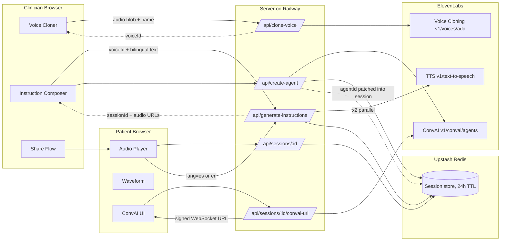

# UtzilCare Voice

> ElevenLabs + UtzilCare = Voice interface for post-operative care instructions.

**Live demo** — https://utzilcare-voice.vercel.app
**API** — https://utzilcare-voiceserver-production.up.railway.app
**Repo** — https://github.com/marcebd/utzilCare-voice

---

## The problem this exists to solve

A child in Quetzaltenango has just had cleft palate surgery. Her mother cannot read the discharge sheet. The doctor is already in another consultation. By the time they get home, neither of them remembers exactly when to give the next dose of antibiotics.

UtzilCare Voice closes that gap. Before discharge, the clinician records 30 seconds of their voice, writes or picks the post-op instructions, and hands the patient a link. The patient opens it and hears their doctor — in their own voice, in a language they speak — reading the instructions aloud. When they have a question later, they can ask it and hear the answer back, still in their doctor's voice.

This is not hypothetical. Two peer-reviewed publications documented this gap in cleft palate post-operative care in Guatemala:

- American Cleft Palate-Craniofacial Association, 2023 — *add exact citation / DOI when filing*
- American Cleft Palate-Craniofacial Association, 2024 — *add exact citation / DOI when filing*

The findings: patients frequently cannot read written instructions, rarely hear from their doctor again after discharge, and have no mechanism to ask follow-up questions in the language they actually speak.

## What it does

### Clinician flow (`/clinician`)

1. **Clone voice.** Record 30–60 seconds of your voice in the browser (MediaRecorder) or upload an MP3/WAV. One call to ElevenLabs `/v1/voices/add` returns a `voiceId` you can preview immediately.
2. **Compose instructions.** Write the post-op plan in Spanish and English, or click one of six bilingual presets (wound care, medications, diet, warning signs, follow-up, activity). Pick the patient's primary language and a reading speed.
3. **Generate.** The backend fans out two parallel TTS calls (one per language), persists the session in Upstash, and creates a Conversational AI agent seeded with the instruction text and a safety-first system prompt.
4. **Share.** Get a patient URL (24h TTL), a copy button, and a QR code ready to print or scan.

### Patient flow (`/patient/:sessionId`)

1. **Always-on safety disclaimer** in the patient's language at the top of the page.
2. **Audio player** with a Web Audio API waveform scrubber (peaks decoded and drawn on canvas, played portion fills forest green). Slow playback applied via `HTMLAudioElement.playbackRate` when the clinician requested it.
3. **Language toggle** swaps both the audio source and the displayed text in one action.
4. **Conversational assistant** powered by ElevenLabs ConvAI — streams audio both directions over a signed WebSocket, accepts voice *or* typed questions, and answers in the cloned doctor's voice in whichever language the patient used.
5. **Accessibility controls** — 120% text scale toggle and high-contrast theme, session-only, no `localStorage`.

## Architecture



## ElevenLabs API surface used

| Feature | Endpoint | Where it lives |
|---|---|---|
| Instant Voice Cloning | `POST /v1/voices/add` | `server/src/lib/elevenlabs.ts` → `cloneVoice()` |
| Multilingual TTS | `POST /v1/text-to-speech/{voice_id}` with `eleven_multilingual_v2` | `server/src/lib/elevenlabs.ts` → `generateSpeech()` |
| Conversational Agents | `POST /v1/convai/agents/create` | `server/src/lib/elevenlabs.ts` → `createConversationalAgent()` |
| ConvAI signed URLs | `GET /v1/convai/conversation/get_signed_url` | `server/src/lib/elevenlabs.ts` → `getConversationSignedUrl()` |
| Client SDK | `@elevenlabs/react` `useConversation` | `client/src/components/patient/PatientConversation.tsx` |

The server maps ElevenLabs error responses to specific codes (`elevenlabs_plan_required`, `elevenlabs_quota_exceeded`, `elevenlabs_invalid_voice`, `elevenlabs_unauthorized`, `elevenlabs_unavailable`) with human-readable messages so the clinician UI can surface actionable guidance rather than raw API errors.

## Safety by construction

The ConvAI system prompt, built in `server/src/routes/agent.ts`, hard-codes the emergency escalation script in both languages:

> If the patient describes severe pain, heavy bleeding, fever above 38.3°C (101°F), difficulty breathing, signs of infection, fainting, or chest pain — your *only* response is: "Esto es una emergencia. Por favor llame a su doctor o vaya a la clínica más cercana inmediatamente." (or the English equivalent).

Additional guardrails baked into the prompt: no diagnosis, no changing medication dose or schedule, no advice beyond the stated instructions, three-sentence answer cap, deflection for out-of-scope questions. The always-visible disclaimer on the patient page reinforces the same rules in the UI.

## Tech stack

- **Frontend** — React 19 · TypeScript 5.7 · Tailwind CSS v4 (Ceiba design system) · React Router 7 · Vite 6
- **Backend** — Node.js 20 · Express 4 · Zod · express-rate-limit · Multer 2
- **Session store** — Upstash Redis (REST) with an in-memory fallback for local dev
- **Deploy** — Vercel (frontend) · Railway (backend)
- **Audio** — MediaRecorder (clinician recording) · Web Audio API (patient waveform) · `@elevenlabs/react` (ConvAI streaming)
- **Design** — Fraunces (display) · DM Sans (body) · JetBrains Mono (data). Forest greens, amber accents, warm cream neutrals — matching the Ceiba design language used across the broader UtzilCare product.

## Running locally

```bash
git clone https://github.com/marcebd/utzilCare-voice.git
cd utzilCare-voice
npm install
cp .env.example .env
```

Fill in `.env`:

```env
ELEVENLABS_API_KEY=sk_...                          # Starter plan or higher (cloning requires it)
UPSTASH_REDIS_REST_URL=https://...upstash.io       # optional; omit to use in-memory fallback
UPSTASH_REDIS_REST_TOKEN=...                        # optional; paired with URL above
PORT=4000
CORS_ORIGIN=http://localhost:5173
```

Run client and server in two terminals:

```bash
npm run dev:server   # http://localhost:4000 (health at /health)
npm run dev:client   # http://localhost:5173
```

## Deployment

- **`vercel.json`** at the repo root tells Vercel to build the `client` workspace and serve `client/dist` with SPA rewrites. Set `VITE_API_URL` in the Vercel project to the deployed server URL.
- **`railway.json`** at the repo root tells Railway to build the `server` workspace, run `node dist/index.js`, and probe `/health`. Set `ELEVENLABS_API_KEY`, `UPSTASH_REDIS_REST_URL`, `UPSTASH_REDIS_REST_TOKEN`, and `CORS_ORIGIN` in the Railway environment.

## What this is (and is not)

**This is** a portfolio demonstration of ElevenLabs' TTS, Voice Cloning, and Conversational AI APIs composed into a real clinical use case. Code is MIT-licensed, open for adaptation.

**This is not** a HIPAA-compliant production system. Deploying this tool with identifiable patient instructions requires:

- A signed Business Associate Agreement with ElevenLabs (or a self-hosted TTS alternative).
- A doctor-facing consent flow for voice cloning (a biometric identifier).
- An audit log for every voice generation and conversation.
- An offline mode for clinics with unreliable connectivity.
- A delivery channel — WhatsApp via Twilio, a printed QR card at discharge, or embedding this into the parent [UtzilCare](https://utzilcare.com) clinic workflow.

These belong on the roadmap, not in a first demo.

## Language support

Spanish and English work today. **Mam, Kaqchikel, and Q'eqchi'** — the three most widely spoken Mayan languages in Guatemala — are the priority next step, pending ElevenLabs multilingual model support for them. The clinical impact in highland clinics will come from those languages, not from English.

## Repository layout

```
utzilCare-voice/
├── client/                          React + Vite + Tailwind v4
│   └── src/
│       ├── components/
│       │   ├── clinician/           VoiceCloner, InstructionComposer, PresetLibrary, ShareFlow
│       │   └── patient/             AudioPlayer, WaveformScrubber, LanguageToggle,
│       │                            PatientConversation, AccessibilityControls
│       ├── hooks/useRecorder.ts     MediaRecorder wrapper
│       ├── lib/api.ts               Typed fetch wrapper for all endpoints
│       └── pages/                   LandingView, ClinicianView, PatientView
├── server/                          Express + TypeScript
│   └── src/
│       ├── lib/
│       │   ├── elevenlabs.ts        All ElevenLabs API calls with typed errors
│       │   ├── sessions.ts          Upstash store + in-memory fallback
│       │   └── audio-cache.ts       In-memory audio bundle cache
│       ├── middleware/              rate-limit, error-handler
│       └── routes/                  clone, generate, preview, agent
├── vercel.json                      Frontend deploy config
├── railway.json                     Backend deploy config
└── README.md                        You are here.
```

## Credits

Built as a portfolio project by [Marcela Billingslea](https://github.com/marcebd). Clinical motivation from ongoing work with [UtzilCare](https://utzilcare.com), a HIPAA-compliant clinic management platform for healthcare providers in Guatemala. Design language shared with UtzilCare's Ceiba system — forest greens for grounding, amber for the Guatemalan sun, warm cream for the earth.

## License

MIT
